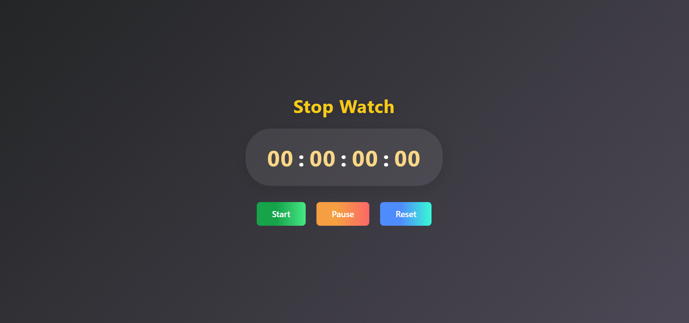

# ⏱️ Stopwatch

A responsive, modern, and accurate digital stopwatch built using **HTML, CSS, and JavaScript**.  
This project features a sleek UI, precise hundredths-of-a-second timing, intuitive controls, and works perfectly across desktop and mobile devices.

---

## 🚀 Features
- **Start**, **Pause**, and **Reset** controls
- **Accurate timekeeping** with hundredths-of-a-second display (00–99 ms)
- **Fully responsive design** for all screen sizes
- **Modern neon-glass look** with gradient backgrounds and button effects
- **No libraries or frameworks required**—just pure HTML, CSS, and JS

---

## 💻 Demo

🌐 **[Live Demo Here](https://stopwatch-ourdeepak.netlify.app/)**  

## 📸 Preview
  

